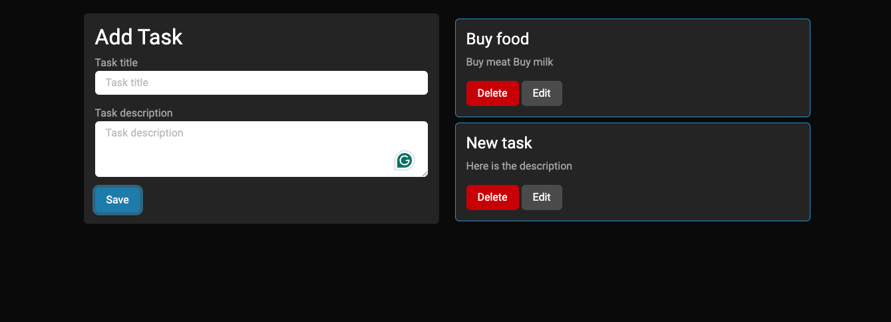

# Firebase CRUD Firestore

Example of app using firebase with firestore

## Description

Example of app using firebase with firestore

## Demo

You can explore a live version of Firebase CRUD Firestore at the following URL:

https://Felipe-Navas.github.io/firebase-crud-firestore

## Getting Started

Preview of the main screen:

## Authors

- [Felipe Navas](https://www.linkedin.com/in/felipenavaslederhos) - [Email](mailto:felipenavas.itec@gmail.com?subject=[GitHub]%firebase-crud-firestore)

## Contributing

1. Fork it (<https://github.com/Felipe-Navas/firebase-crud-firestore/fork>)
2. Create your feature branch (`git checkout -b feature/fooBar`)
3. Commit your changes (`git commit -am 'Add some fooBar'`)
4. Push to the branch (`git push origin feature/fooBar`)
5. Create a new Pull Request
